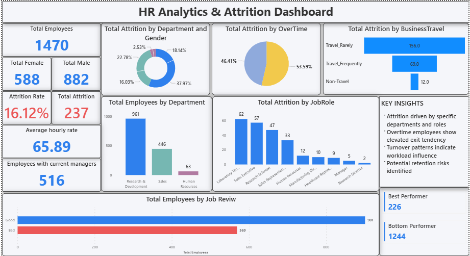

# HR Analytics & Attrition Dashboard

## 📊 Project Overview

This project presents an interactive **HR Analytics & Attrition Dashboard** built using **Power BI** to analyze workforce composition, employee demographics, and attrition behavior.

The dashboard enables intuitive exploration of key HR metrics and highlights patterns influencing employee turnover, supporting data-driven decision-making and workforce planning.

---

## 🎯 Objectives

- Analyze employee distribution across departments and demographics  
- Identify attrition patterns and potential risk areas  
- Evaluate the impact of overtime on employee turnover  
- Explore income trends and workforce characteristics  
- Demonstrate practical Power BI and data modeling skills  

---

## 🛠 Tools & Technologies

- **Power BI** – Data visualization & dashboard design  
- **DAX** – Analytical calculations & measures  
- **Power Query** – Data transformation & preparation  
- **SQL / Excel** – Data sources & preprocessing  

---

## 📈 Key Insights Delivered

- Department-wise attrition analysis  
- Workforce distribution by gender and demographics  
- Overtime impact on employee attrition  
- Income trends across employee segments  
- Employee age and experience patterns  

---

## 🧩 Dashboard Features

✔ Interactive visuals and KPIs  
✔ Attrition analysis across departments  
✔ Demographic breakdowns  
✔ Drill-down and filtering capabilities  
✔ Clean, business-focused layout  

---

## 🖼 Dashboard Preview
## 🔗 Live Dashboard Access

The dashboard is published on Power BI Service and can be accessed here:

🌐 https://app.powerbi.com/groups/me/reports/0c8551a9-e4e3-4051-9370-805eae0441a5/ReportSection?experience=power-bi

---

## 💡 Business Value

The dashboard helps simulate real-world HR analytics scenarios by uncovering workforce patterns and attrition drivers.  
It demonstrates how data visualization and analytics can assist organizations in improving retention strategies and operational insights.

---

## 🚀 Skills Demonstrated

- Data modeling & transformation  
- DAX measures & calculations  
- Analytical dashboard design  
- Business-oriented data storytelling  
- KPI-driven reporting  

---

## 📌 Notes

This project is part of a practical analytics portfolio focused on applying BI and data analysis concepts to realistic business datasets.
